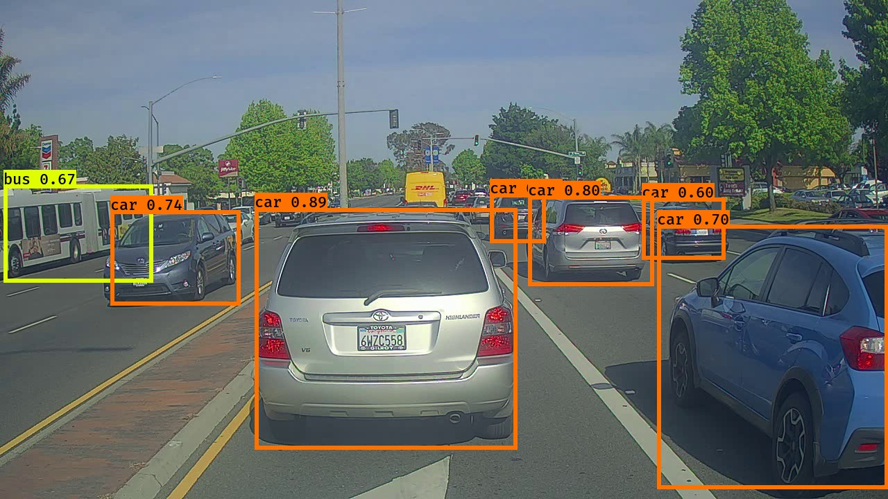

# YOLO_Object_Detection
Implementing object detection in images in view of building an obstacle avoidance algorithm. 

Couple of functions taken from Coursera's Convolutional Neural Networks Week 3 project.

Takes an image like this - 

And draws bounding boxes on all recognized objects, like this- 

